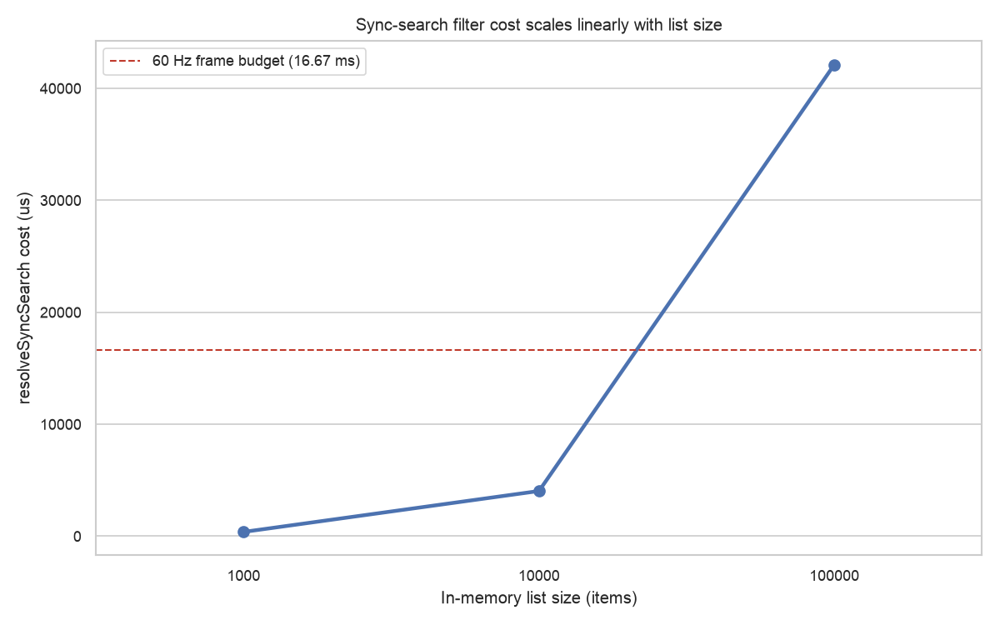

[](https://github.com/LahaLuhem/list_smith/actions/workflows/package.yml)
[](https://coveralls.io/github/LahaLuhem/list_smith?branch=main)
[](https://github.com/LahaLuhem/list_smith/pulls)
[](https://pub.dev/packages/list_smith)
[](https://pub.dev/packages/list_smith/score)
[](./LICENSE)
[](https://github.com/LahaLuhem/list_smith/issues)
[](https://github.com/LahaLuhem/list_smith/issues?q=is%3Aissue+is%3Aclosed)
[](https://github.com/LahaLuhem/list_smith/pulls)
[](https://github.com/LahaLuhem/list_smith/pulls?q=is%3Apr+is%3Aclosed)

**list_smith** wraps `ListView.builder` for the lists you actually ship: async pagination,
pull-to-refresh, and search (sync or async). You hand it a data source, an item builder, and a bit of
config. It takes care of the scrollable, the controller, and every fiddly loading, error, and empty
state in between, and never asks you to touch any of them.

Two things set it apart. It stays **fully out of your way**: you never see a `ScrollController`, a
`PagingController`, or the [`infinite_scroll_pagination`](https://pub.dev/packages/infinite_scroll_pagination)
it wraps and hides. And it brings **no design system**. Every surface it draws is a plain
`widgets`-layer default, so the list drops into a Material app, a Cupertino app, or your own bespoke
thing without dragging in a look you didn't choose.

## Install

```sh
flutter pub add list_smith
```

## A quick taste

Give it a function that fetches a page and a builder for each item. That really is the whole setup:

```dart
ListSmith.async(
  fetchPage: (pageIndex, pageSize) => api.fetchArticles(page: pageIndex, size: pageSize),
  itemBuilder: (context, article, index) => ArticleTile(article),
)
```

That list already paginates as you scroll, pulls to refresh, shows a loader on the first page and a
smaller one while the next page comes in, surfaces errors with a retry button, and knows when it has
hit the end. No controller to wire up, no scroll listener, no `ListView` in sight.

## Two kinds of list

There are two constructors, and which one you reach for comes down to where your data lives.

| Constructor       | Best for                                | Handles                                                |
|-------------------|-----------------------------------------|--------------------------------------------------------|
| `ListSmith.async` | data fetched a page at a time (an API)  | pagination, pull-to-refresh, and optional async search |
| `ListSmith.sync`  | a list you already hold in memory       | client-side search, nothing to paginate                |

Each takes only the parameters that make sense for it, so nothing you pass is ever quietly ignored.

## Pagination

`ListSmith.async` calls your `fetchPage` with a 0-based page index and the page size, then asks for
the next page as the user nears the end. Return the items for that page (any `Iterable`; it gets
materialised once for you). When a page comes back empty, that is the end of the road:

```dart
ListSmith.async(
  pageSize: 30,
  fetchPage: (pageIndex, pageSize) => repo.load(pageIndex, pageSize),
  itemBuilder: (context, item, index) => Text(item.title),
)
```

### Deciding where the data ends

An empty page meaning "the end" is the sensible default, but it isn't always right. A calendar feed,
say, can have an empty day in the middle with plenty of data after it. So end-detection is a policy
you can swap out:

| Policy                               | Ends when                                                          |
|--------------------------------------|--------------------------------------------------------------------|
| `StopOnEmptyPagesPolicy` *(default)* | a page comes back empty (raise `emptyRunBeforeEnd` to allow gaps)  |
| `FixedPageCountPolicy`               | a set number of pages have loaded                                  |

```dart
// Allow up to two empty pages before calling it the end:
endPolicy: const StopOnEmptyPagesPolicy(emptyRunBeforeEnd: 3),

// Or just stop after five pages:
endPolicy: const FixedPageCountPolicy(pageCount: 5),
```

## Pull to refresh

On by default for `ListSmith.async`. Pull down, the list resets and reloads from the first page.
Nothing to set up.

Switch it off with `pullToRefresh: false`. Prefer your own indicator over the neutral one? Pass a
`refreshBuilder` through the surfaces (more on those below). It receives a small, framework-free
snapshot of the pull (a phase and a drag value), never the controller underneath.

## Search

This is where the two constructors part ways the most.

### In memory, with `ListSmith.sync`

Already holding the whole list? Give `.sync` the items and a predicate that decides whether an item
matches the current query. It filters client-side and shows a "no results" surface when nothing does:

```dart
ListSmith.sync(
  items: allCities,
  searchBy: (city, query) => city.name.toLowerCase().contains(query.toLowerCase()),
  query: searchQuery, // you own the field; more on that below
  itemBuilder: (context, city, index) => Text(city.name),
)
```

There's no pagination or pull-to-refresh here, because there's nothing to page or refresh over a list
that is already in memory. And if you don't need search at all, you don't need this: a plain
`ListView.builder` will do.

### Paged, with `ListSmith.async` and a search fetcher

Add a `searchFetchPage` to an async list and it grows a second mode. An empty query shows the normal
paginated feed; a non-empty one switches to paginated *search results* fetched by your search
function, and back again once the query clears. One list, two views, with pagination and
pull-to-refresh still working in both:

```dart
ListSmith.async(
  fetchPage: (pageIndex, pageSize) => repo.feed(pageIndex, pageSize),
  searchFetchPage: (query, pageIndex, pageSize) => repo.search(query, pageIndex, pageSize),
  query: searchQuery,
  itemBuilder: (context, item, index) => Text(item.title),
)
```

#### What happens to the feed while you search?

When the list flips between the feed and the search results, what should become of the feed you were
looking at? Another policy:

| Policy                           | Entering and leaving search                                                       |
|----------------------------------|-----------------------------------------------------------------------------------|
| `ReplaceCachePolicy` *(default)* | each mode loads clean; leaving search reloads the feed from the top               |
| `KeepCachePolicy`                | the feed is snapshotted on the way in and restored on the way out, no refetch     |

```dart
searchCachePolicy: const KeepCachePolicy(),
```

### You keep the search field

list_smith renders no text field. You keep your own (every app already has one), hold the query in
state, and pass it in as `query`. The whole loop is small:

```dart
// inside a StatefulWidget's State:
var _query = '';

@override
Widget build(BuildContext context) => Column(
  children: [
    // your field: a TextField, a CupertinoTextField, your design system's search bar, wherever
    TextField(onChanged: (value) => setState(() => _query = value)),
    Expanded(
      child: ListSmith.async(
        query: _query,
        fetchPage: (pageIndex, pageSize) => repo.feed(pageIndex, pageSize),
        searchFetchPage: (query, pageIndex, pageSize) => repo.search(query, pageIndex, pageSize),
        itemBuilder: (context, item, index) => Text(item.title),
      ),
    ),
  ],
);
```

Prefer a `ValueNotifier` and a `ValueListenableBuilder` so you don't rebuild the whole widget? That
works too. The field can sit anywhere (an app bar, a sheet), as long as it feeds `query`. Clearing is
just `_query = ''`; list_smith flips back to the feed on its own.

Two knobs shape how the query is handled:

- **`searchDebounce`** waits for typing to settle before searching. Defaults to 300ms on async (go
  easy on your server) and to zero on sync, where an in-memory filter is instant anyway.
- **`minSearchLength`** ignores anything shorter than N characters.

The query is trimmed first, so a field full of spaces counts as empty.

## Make it look like your app

Every surface list_smith draws (the loaders, the errors, the empty state, the "that's everything"
footer, the pull indicator) is a neutral `widgets`-layer default. Neutral on purpose: no
`CircularProgressIndicator`, nothing from Material or Cupertino, so nothing fights the app you've
built. When you want your own look, override the slot.

Two surfaces sit right on the constructor, because every list has them:

- **`emptyBuilder`**, when the source holds no items at all
- **`noResultsBuilder`**, when a search matched nothing (it is handed the query)

The rest are async-only, so they're gathered into an `AsyncListSurfaces` you can define once and reuse
across every list for one consistent house style:

```dart
ListSmith.async(
  fetchPage: ...,
  itemBuilder: ...,
  emptyBuilder: (context) => const Center(child: Text('Nothing here yet')),
  surfaces: AsyncListSurfaces(
    firstPageLoadingBuilder: (context) => const MySpinner(),
    firstPageErrorBuilder: (context, error, onRetry) => MyError(error, onRetry: onRetry),
    noMoreItemsBuilder: (context) => const Text("That's everything"),
  ),
)
```

<details>
<summary><b>The full set of surface slots</b></summary>

On the constructor (any list):

| Slot               | Shown when                                    |
|--------------------|-----------------------------------------------|
| `emptyBuilder`     | the source has no items                       |
| `noResultsBuilder` | a search matched nothing (receives the query) |

In `AsyncListSurfaces` (async lists only):

| Slot                      | Shown when                                                |
|---------------------------|-----------------------------------------------------------|
| `firstPageLoadingBuilder` | the first page is loading                                 |
| `newPageLoadingBuilder`   | a further page is loading                                 |
| `firstPageErrorBuilder`   | the first page failed (receives the error + a retry call) |
| `newPageErrorBuilder`     | a further page failed (receives the error + a retry call) |
| `noMoreItemsBuilder`      | every page has loaded                                     |
| `refreshBuilder`          | drawing the pull-to-refresh indicator                     |

The error builders get `(context, error, onRetry)`, so a custom error view can offer a retry without
you reaching for a controller. Leave any slot out and its neutral default fills in.

</details>

## Watching what it does

Sometimes you want to know what the list is up to: log a load, report an error to your crash tool,
count how often people search. Pass an `observer` and those events come to you, with none of the
internals leaking out. Every callback hands you plain values (a page index, a count, the query, the
error), never a controller or a paging type:

```dart
final class MyObserver extends ListSmithObserver {
  const MyObserver();

  @override
  void onError(Object error, StackTrace stackTrace) => crashReporter.record(error, stackTrace);
}

ListSmith.async(
  fetchPage: ...,
  itemBuilder: ...,
  observer: const MyObserver(),
)
```

Override only the events you care about; the rest cost nothing. You get `onPageLoaded`, `onError`,
`onRefresh`, `onQueryCommitted`, and `onSearchModeChanged`. Just debugging, or in a hurry? Drop in the
ready-made `LoggingListSmithObserver()` and every event goes through `dart:developer`, so it shows up
in DevTools and stays `avoid_print`-clean. Whatever you override runs synchronously while a
page loads, so keep it light: a slow callback delays rendering (see [Performance](#performance)).

> Observers are async-only. A `.sync` list has no fetch, refresh, or controller to observe, and you
> already hold the query it filters on.

## Scroll and layout

Padding, physics, a scroll controller, reverse, direction, cache extent: the usual scrollable knobs
live together in a `ListScrollConfig`, kept clear of the behavioural parameters so neither crowds the
other.

```dart
scroll: const ListScrollConfig(
  padding: EdgeInsets.all(16),
  physics: BouncingScrollPhysics(),
),
```

## Performance

list_smith is a thin wrapper over `infinite_scroll_pagination` and `custom_refresh_indicator`, and
the wrapping is close to free. Measured on one machine (yours will differ), from the committed
[benchmark report](benchmark/reports/SUMMARY.md):

- **Scrolling costs what a bare list costs.** A `ListSmith.async` scroll runs within ~0.03 ms/frame
  of a plain `ListView.builder` over the same items, and neither drops a frame. The per-page
  bookkeeping (end-policy check, observer dispatch) is sub-microsecond to a few microseconds.
- **Pull-to-refresh is cheap.** A full custom_refresh_indicator cycle builds at ~0.4 ms/frame, with
  0 frames over the 16.67 ms budget.
- **Sync search is O(n) per committed query.** `ListSmith.sync` re-filters the whole list on each
  query. With a naive case-insensitive `contains` that's ~0.4 ms at 1k items, ~4 ms at 10k, and
  ~42 ms at 100k, where it crosses the frame budget. For big in-memory lists, lean on the built-in
  debounce or reach for the async path.
- **Observers are on the critical path.** list_smith calls your `observer` synchronously while
  a page loads, so a slow callback delays rendering roughly 1:1 (a 50 ms observer pushed render
  latency to ~68 ms). Keep them cheap: log, count, report; do heavy work elsewhere.

Numbers are per-machine and won't match yours; capture your own baseline before trusting a
delta. The suite (methodology, micro-benchmarks, profile-mode scenarios) lives in
[`benchmark/`](benchmark/), and `run.py compare` diffs two runs with a Mann-Whitney test to catch
regressions.



## Coming from smart_search_list

list_smith is the ground-up successor to
[`smart_search_list`](https://pub.dev/packages/smart_search_list): the same good ideas, with the sharp
edges filed off.

- **No ghost parameters.** Every parameter actually does something on the constructor that exposes it.
  The old package let you set knobs that quietly did nothing on one path; that whole class of bug is
  designed out.
- **Pagination that isn't guessing.** The old scroll-offset arithmetic for "are we near the end yet?"
  gives way to `infinite_scroll_pagination`'s index-based trigger, which sidesteps the flaky
  end-of-page detection.
- **Your app, your look.** You never touch a controller, and no design system is forced on you.

## Roadmap

- [x] Async pagination with swappable end-detection
- [x] Pull-to-refresh
- [x] Sync (in-memory) search
- [x] Async two-view search with a cache policy
- [x] Lifecycle observer
- [ ] `hasMore`-style end policies (`ExplicitHasMore`, `ServerSentinel`) for sources that report the
  end themselves

## The example app

The [`example/`](example/) app is the best place to watch it all work: a basic feed, fully custom
surfaces, a playground with live knobs, both flavours of search, and an observer demo that streams
every lifecycle event into a panel as you scroll, refresh, and type.

## Contributing

Issues and pull requests are welcome. Have a look at [`AGENTS.md`](.ai/AGENTS.md) for the conventions
and [`CODESTYLE.md`](CODESTYLE.md) for the code style before you start, and the reasoning behind the
bigger design decisions lives in [`APPENDIX.md`](APPENDIX.md).
