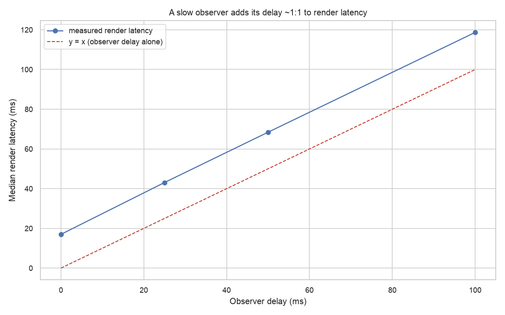
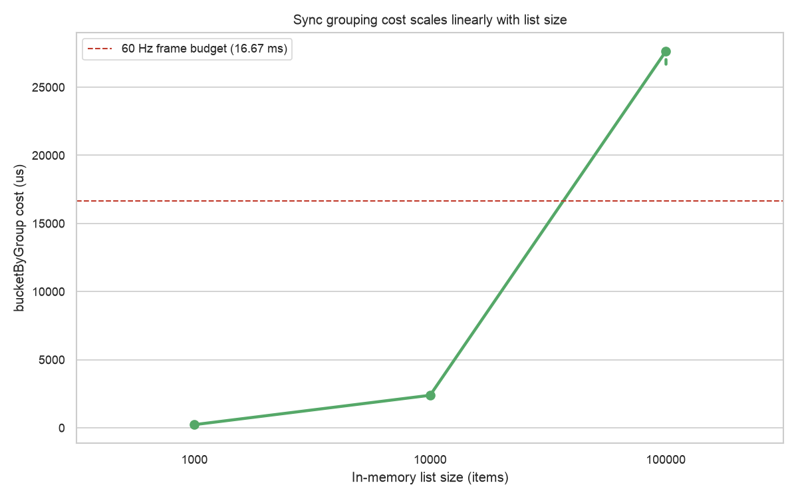
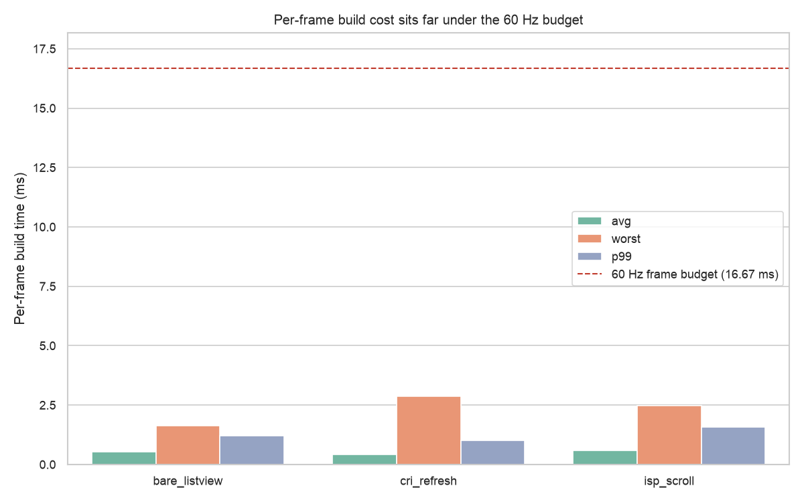

# Benchmark results

Captured **2026-07-16** against `0.0.1` at `6e8008a` on Dart SDK 3.12.2. N=10 iterations.

> Per-machine measurements. Numbers reflect *this* machine (CPU, GPU, GC, OS scheduler, thermal state). Your numbers WILL differ; capture your own local baseline before measuring a code delta.

## Observer on the critical path: a slow observer blocks rendering

The headline finding. `slow_observer` (profile-mode) wires an observer that blocks for a set delay on each callback and measures render latency over a page load, swept across several delays. list_smith invokes the observer *synchronously* on the page-load path, so the block lands almost fully on the critical path: render latency tracks the delay ~1:1, on top of a fixed baseline render (~18 ms here), so a 50 ms observer pushes it to ~68 ms. Takeaway for consumers: keep observer callbacks cheap (logging, metrics); push heavy work off the synchronous path.

| Observer delay (ms) | Median render latency (ms) | Render minus observer (ms) | N |
|---:|---:|---:|---:|
| 0 | 17.0 | 17.0 | 10 |
| 25 | 43.1 | 18.1 | 10 |
| 50 | 68.4 | 18.4 | 10 |
| 100 | 118.7 | 18.7 | 10 |

## Sync-search filter cost vs list size

From the `sync_search_scaling` micro (AOT, `benchmark_harness`). `SyncListView` re-runs `resolveSyncSearch` (an `items.where(predicate).toList()`) synchronously on every committed query; this measures that cost as the in-memory list grows, with a naive case-insensitive `contains` predicate. Where the median crosses the frame budget is the practical ceiling for sync search with this predicate.

| List size | N | Median (us) | IQR (us) | Median (ms) |
|---:|---:|---:|---:|---:|
| 1,000 | 10 | 371.14 | 4.35 | 0.37 |
| 10,000 | 10 | 3,931 | 26.12 | 3.93 |
| 100,000 | 10 | 41,191 | 391.72 | 41.19 |

## Sync grouping (bucketing) cost vs list size

From the `bucket_by_group_scaling` micro (AOT, `benchmark_harness`). Sync grouping reorders the filtered items into contiguous sections via `bucketByGroup` (`groupListsBy` + flatten) on every committed query; this measures that cost as the list grows, over fully interleaved input (worst-case reordering). It stacks on the search-filter cost above when a sync list both searches and groups.

| List size | N | Median (us) | IQR (us) | Median (ms) |
|---:|---:|---:|---:|---:|
| 1,000 | 10 | 229.34 | 5.03 | 0.23 |
| 10,000 | 10 | 2,361 | 16.32 | 2.36 |
| 100,000 | 10 | 26,958 | 417.28 | 26.96 |

## Wrapping overhead: list_smith on top of ISP

Confirms the wrapping costs ~nothing. `observer_dispatch` is one no-op observer callback (the null-check + virtual call list_smith makes in `_fetchPage`); `wrapping_overhead` is the per-`getNextPageKey` cost (rebuild the page-item-counts + run the end policy) as loaded pages grow. Both are dwarfed by any real fetch.

| Micro | Metric | Median (us) |
|---|---|---:|
| `observer_dispatch` | us / dispatch | 0.011 |
| `wrapping_overhead` (1 page) | us / key | 0.519 |
| `wrapping_overhead` (10 pages) | us / key | 1.28 |
| `wrapping_overhead` (100 pages) | us / key | 7.85 |

## UI scroll/refresh: per-frame build cost

From the profile-mode `integration_test` scenarios (real frames on this machine). `avg`/`worst`/`p99 build` are the UI-thread build cost per frame (where list_smith's code runs); `missed` counts frames over the 16.67ms budget. `isp_scroll` vs `bare_listview` (same items + scroll, no list_smith) is the attribution: the small delta is what list_smith-over-ISP adds on top of a plain list.

| Scenario | Frames | Avg build (ms) | Worst build (ms) | p99 build (ms) | Missed |
|---|---:|---:|---:|---:|---:|
| `bare_listview` | 610 | 0.53 | 1.64 | 1.21 | 0 |
| `cri_refresh` | 850 | 0.42 | 2.87 | 1.01 | 0 |
| `isp_scroll` | 610 | 0.58 | 2.48 | 1.57 | 0 |

