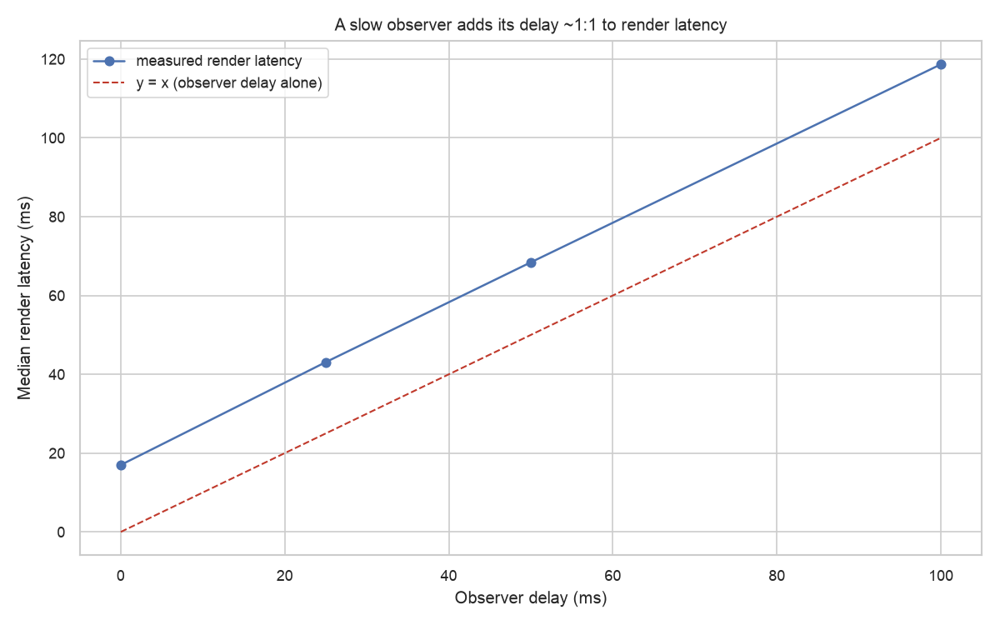
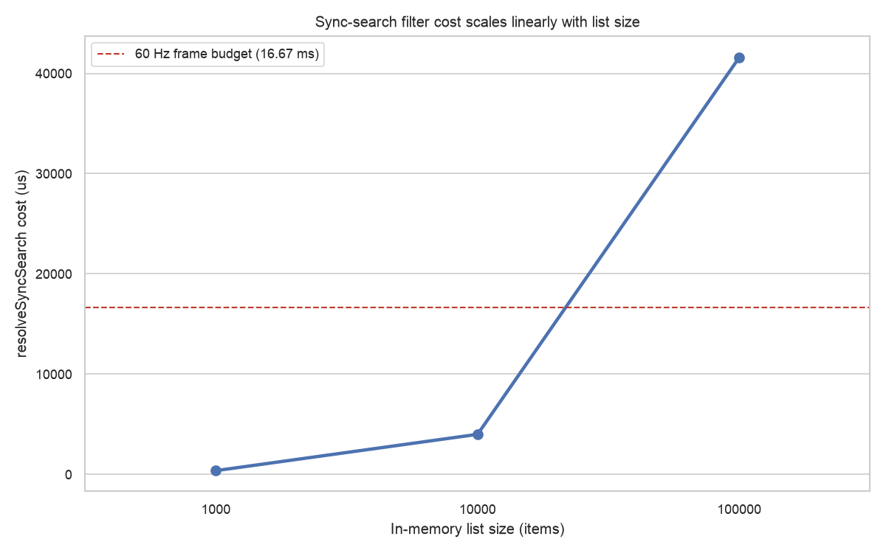
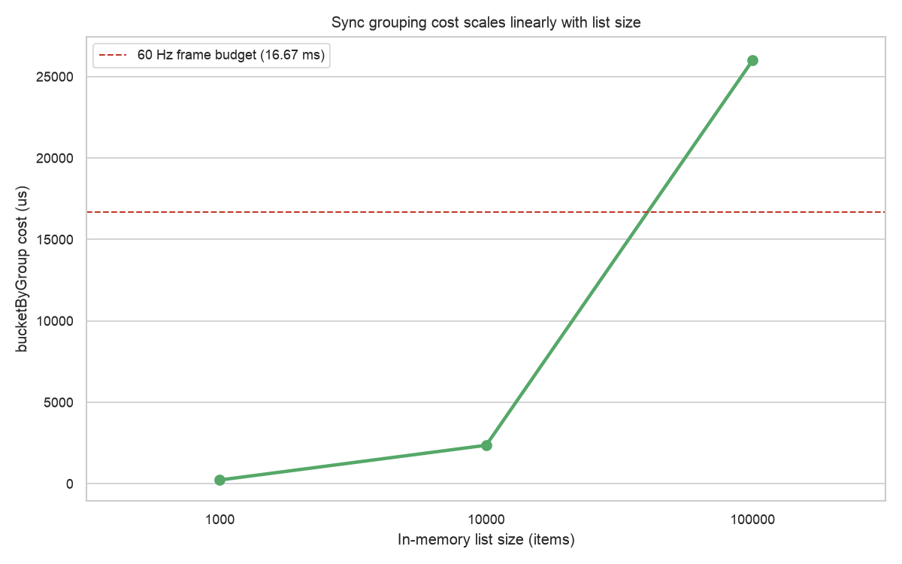
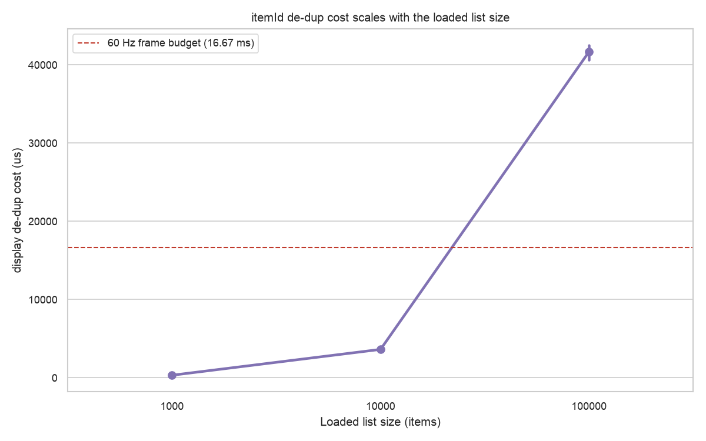
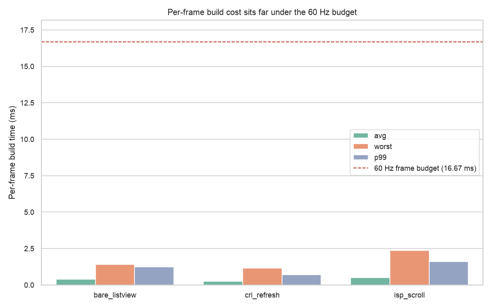

# Benchmark results

Captured **2026-07-18** against `0.0.1` at `63b7319` on Dart SDK 3.12.2. N=10 iterations.

> Per-machine measurements, reflecting *this* machine's CPU, GPU, GC, OS scheduler and thermal state. Yours WILL differ, so capture your own baseline before measuring a delta.

## Observer on the critical path: a slow observer blocks rendering

The headline finding. list_smith invokes your observer *synchronously* on the page-load path, so a slow callback lands almost fully on the critical path. `slow_observer` blocks for a set delay on each callback and measures render latency across a sweep of delays: latency tracks the delay ~1:1 on top of a fixed baseline render, so a 50 ms observer pushes ~18 ms to ~68 ms. Keep observer callbacks cheap and do heavy work elsewhere.

| Observer delay (ms) | Median render latency (ms) | Render minus observer (ms) | N |
|---:|---:|---:|---:|
| 0 | 17.2 | 17.2 | 10 |
| 25 | 44.0 | 19.0 | 10 |
| 50 | 69.2 | 19.2 | 10 |
| 100 | 119.4 | 19.4 | 10 |

## Sync-search filter cost vs list size

From the `sync_search_scaling` micro (AOT, `benchmark_harness`). `SyncListView` re-runs `resolveSyncSearch` synchronously on every committed query, so this is that cost as the in-memory list grows, under a naive case-insensitive `contains`. Where the median crosses the frame budget is the practical ceiling for that predicate.

| List size | N | Median (us) | IQR (us) | Median (ms) |
|---:|---:|---:|---:|---:|
| 1,000 | 10 | 370.43 | 1.53 | 0.37 |
| 10,000 | 10 | 3,925 | 44.34 | 3.93 |
| 100,000 | 10 | 41,064 | 263.76 | 41.06 |

## Sync grouping (bucketing) cost vs list size

From the `bucket_by_group_scaling` micro (AOT, `benchmark_harness`). Sync grouping reorders the filtered items into contiguous sections on every committed query, so this is that cost as the list grows, over fully interleaved input for worst-case reordering. It stacks on the search-filter cost above when a list does both.

| List size | N | Median (us) | IQR (us) | Median (ms) |
|---:|---:|---:|---:|---:|
| 1,000 | 10 | 225.95 | 1.56 | 0.23 |
| 10,000 | 10 | 2,353 | 26.33 | 2.35 |
| 100,000 | 10 | 26,079 | 127.91 | 26.08 |

## Overlap de-dup cost vs loaded list size

From the `dedup_scaling` micro (AOT, `benchmark_harness`). With an `itemId`, the async list de-dups overlapping pages as a computed view over the paging state, re-walking every loaded item on each change so the stored pages stay raw and the end policy can't read an all-duplicate page as the end. Measured at its worst case: `itemId` set with no actual overlap, so nothing collapses and every item is retained. Opt-in, and off the scroll path since it runs per page-load rather than per frame. Sub-millisecond for a few thousand loaded items and climbing from there, so past tens of thousands in one live list, de-duplicate at the source.

| Loaded items | N | Median (us) | IQR (us) | Median (ms) |
|---:|---:|---:|---:|---:|
| 1,000 | 10 | 320.82 | 16.65 | 0.32 |
| 10,000 | 10 | 3,601 | 198.99 | 3.60 |
| 100,000 | 10 | 41,703 | 2,001 | 41.70 |

## Wrapping overhead: list_smith on top of ISP

Confirms the wrapping costs ~nothing. `observer_dispatch` is one no-op observer callback, the null-check plus virtual call made in `_fetchPage`. `wrapping_overhead` is the per-`getNextPageKey` cost, rebuilding the page-item-counts and running the end policy, as loaded pages grow. Any real fetch dwarfs both.

| Micro | Metric | Median (us) |
|---|---|---:|
| `observer_dispatch` | us / dispatch | 0.011 |
| `wrapping_overhead` (1 page) | us / key | 0.544 |
| `wrapping_overhead` (10 pages) | us / key | 1.29 |
| `wrapping_overhead` (100 pages) | us / key | 8.15 |

## UI scroll/refresh: per-frame build cost

From the profile-mode `integration_test` scenarios, real frames on this machine. `avg`, `worst` and `p99 build` are the UI-thread build cost per frame, which is where list_smith's code runs, and `missed` counts frames over the 16.67ms budget. `isp_scroll` against `bare_listview` (same items and scroll, no list_smith) is the attribution: that small delta is what the wrapper adds to a plain list.

| Scenario | Frames | Avg build (ms) | Worst build (ms) | p99 build (ms) | Missed |
|---|---:|---:|---:|---:|---:|
| `bare_listview` | 610 | 0.63 | 2.13 | 1.70 | 0 |
| `cri_refresh` | 850 | 0.46 | 1.49 | 1.15 | 0 |
| `isp_scroll` | 609 | 0.68 | 4.30 | 1.86 | 0 |

