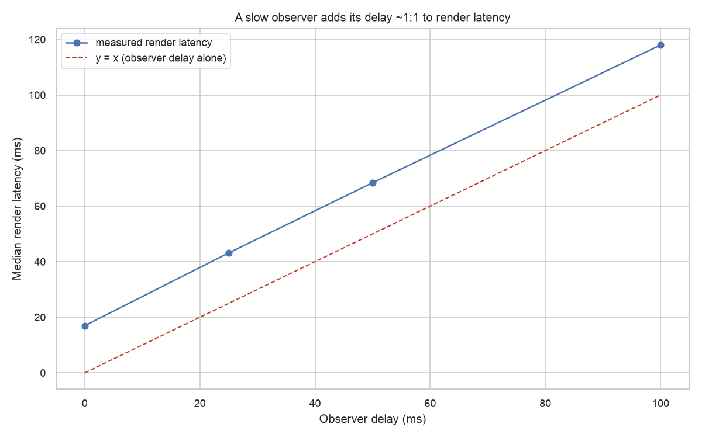
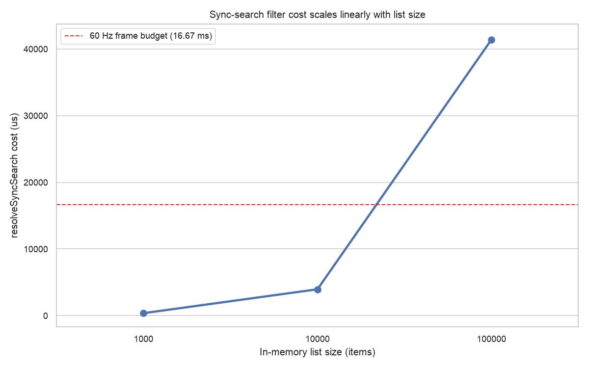
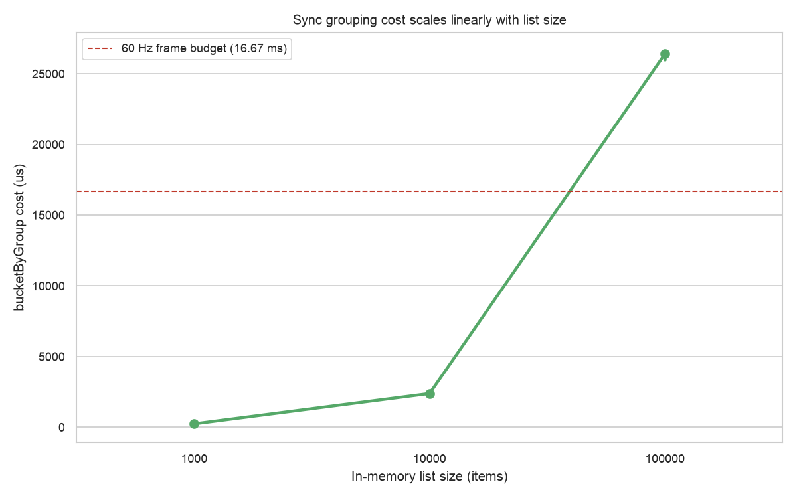
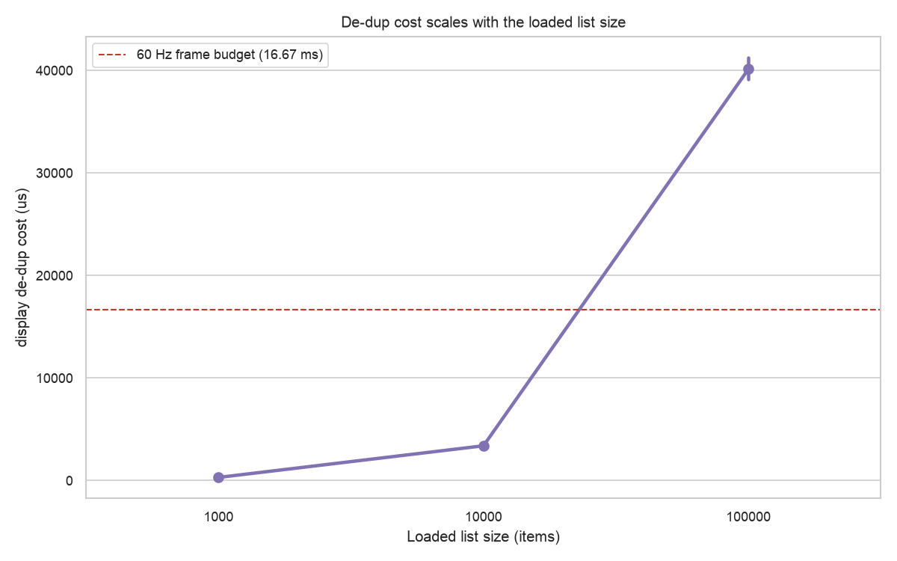
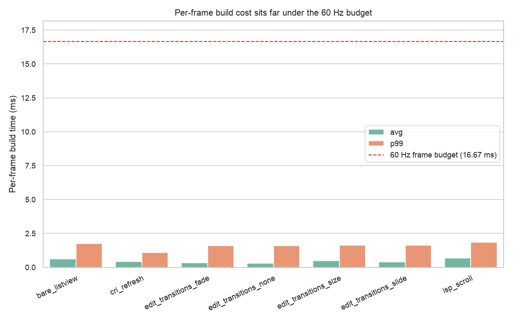
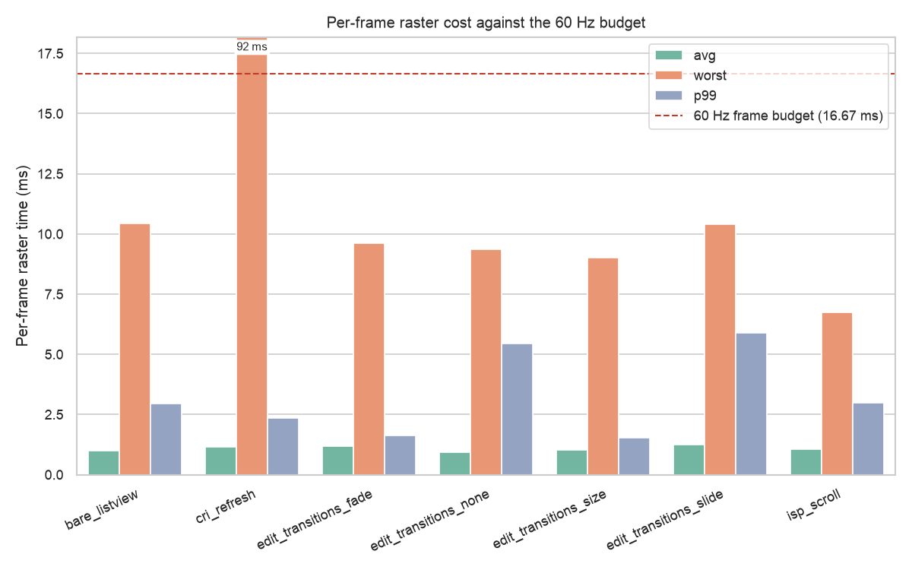

# Benchmark results

Captured **2026-09-30** against `1.0.0` at `15aaf6e` on Dart SDK 3.13.4. N=10 iterations.

> Per-machine measurements, reflecting *this* machine's CPU, GPU, GC, OS scheduler and thermal state. Yours WILL differ, so capture your own baseline before measuring a delta.

## Observer on the critical path: a slow observer blocks rendering

The headline finding. list_smith invokes your observer *synchronously* on the page-load path, so a slow callback lands almost fully on the critical path. `slow_observer` blocks for a set delay on each callback and measures render latency across a sweep of delays: latency tracks the delay ~1:1 on top of a fixed baseline render, so a 50 ms observer pushes ~18 ms to ~68 ms. Keep observer callbacks cheap and do heavy work elsewhere.

| Observer delay (ms) | Median render latency (ms) | Render minus observer (ms) | N |
|---:|---:|---:|---:|
| 0 | 17.0 | 17.0 | 10 |
| 25 | 43.1 | 18.1 | 10 |
| 50 | 68.4 | 18.4 | 10 |
| 100 | 118.0 | 18.0 | 10 |

## Sync-search filter cost vs list size

From the `sync_search_scaling` micro (AOT, `benchmark_harness`). `SyncListView` re-runs `resolveSyncSearch` synchronously on every committed query, so this is that cost as the in-memory list grows, under a naive case-insensitive `contains`. Where the median crosses the frame budget is the practical ceiling for that predicate.

| List size | N | Median (us) | IQR (us) | Median (ms) |
|---:|---:|---:|---:|---:|
| 1,000 | 10 | 371.38 | 1.32 | 0.37 |
| 10,000 | 10 | 3,940 | 7.86 | 3.94 |
| 100,000 | 10 | 41,315 | 78.06 | 41.31 |

## Sync grouping (bucketing) cost vs list size

From the `bucket_by_group_scaling` micro (AOT, `benchmark_harness`). Sync grouping reorders the filtered items into contiguous sections on every committed query, so this is that cost as the list grows, over fully interleaved input for worst-case reordering. It stacks on the search-filter cost above when a list does both.

| List size | N | Median (us) | IQR (us) | Median (ms) |
|---:|---:|---:|---:|---:|
| 1,000 | 10 | 231.50 | 3.59 | 0.23 |
| 10,000 | 10 | 2,372 | 32.50 | 2.37 |
| 100,000 | 10 | 25,689 | 412.04 | 25.69 |

## Overlap de-dup cost vs loaded list size

From the `dedup_scaling` micro (AOT, `benchmark_harness`). The async list de-dups overlapping pages by id as a computed view over the paging state, re-walking every loaded item on each change so the stored pages stay raw and the end policy can't read an all-duplicate page as the end. Measured at its worst case: no actual overlap, so nothing collapses and every item is retained. Off the scroll path, since it runs per page-load rather than per frame. Sub-millisecond for a few thousand loaded items and climbing from there, past the frame budget at tens of thousands in one live list.

| Loaded items | N | Median (us) | IQR (us) | Median (ms) |
|---:|---:|---:|---:|---:|
| 1,000 | 10 | 293.86 | 0.690 | 0.29 |
| 10,000 | 10 | 3,300 | 9.46 | 3.30 |
| 100,000 | 10 | 40,114 | 988.92 | 40.11 |

## Wrapping overhead: list_smith on top of ISP

Confirms the wrapping costs ~nothing. `observer_dispatch` is one no-op observer callback, the null-check plus virtual call made in `_fetchPage`. `wrapping_overhead` is the per-`getNextPageKey` cost, rebuilding the page-item-counts and running the end policy, as loaded pages grow. Any real fetch dwarfs both.

| Micro | Metric | Median (us) |
|---|---|---:|
| `observer_dispatch` | us / dispatch | 0.011 |
| `wrapping_overhead` (1 page) | us / key | 0.563 |
| `wrapping_overhead` (10 pages) | us / key | 1.31 |
| `wrapping_overhead` (100 pages) | us / key | 8.09 |

## UI scenarios: per-frame build cost

From the profile-mode `integration_test` scenarios, real frames on this machine. `avg`, `worst` and `p99 build` are the UI-thread build cost per frame, which is where list_smith's code runs, and `missed` counts frames over the 16.67ms budget. `isp_scroll` against `bare_listview` (same items and scroll, no list_smith) is the attribution: that small delta is what the wrapper adds to a plain list. `edit_transitions_none` makes the same edits as `_size`, `_fade` and `_slide` with no transition, so the gap is what animating them adds.

| Scenario | Frames | Avg build (ms) | Worst build (ms) | p99 build (ms) | Missed |
|---|---:|---:|---:|---:|---:|
| `bare_listview` | 610 | 0.56 | 1.81 | 1.47 | 0 |
| `cri_refresh` | 849 | 0.40 | 1.27 | 1.19 | 0 |
| `edit_transitions_fade` | 500 | 0.35 | 2.01 | 1.88 | 0 |
| `edit_transitions_none` | 500 | 0.25 | 2.13 | 1.92 | 0 |
| `edit_transitions_size` | 500 | 0.42 | 1.95 | 1.39 | 0 |
| `edit_transitions_slide` | 500 | 0.40 | 2.24 | 1.99 | 0 |
| `isp_scroll` | 610 | 0.61 | 2.34 | 1.46 | 0 |

## UI scenarios: per-frame raster cost

The same frames on the raster thread, which draws what the build produced. `missed` counts frames over the same budget.

| Scenario | Frames | Avg raster (ms) | Worst raster (ms) | p99 raster (ms) | Missed |
|---|---:|---:|---:|---:|---:|
| `bare_listview` | 610 | 1.01 | 10.45 | 2.95 | 0 |
| `cri_refresh` | 849 | 1.16 | 91.99 | 2.34 | 1 |
| `edit_transitions_fade` | 500 | 1.19 | 9.62 | 1.64 | 0 |
| `edit_transitions_none` | 500 | 0.93 | 9.36 | 5.45 | 0 |
| `edit_transitions_size` | 500 | 1.04 | 9.01 | 1.52 | 0 |
| `edit_transitions_slide` | 500 | 1.25 | 10.41 | 5.88 | 0 |
| `isp_scroll` | 610 | 1.07 | 6.74 | 2.99 | 0 |

