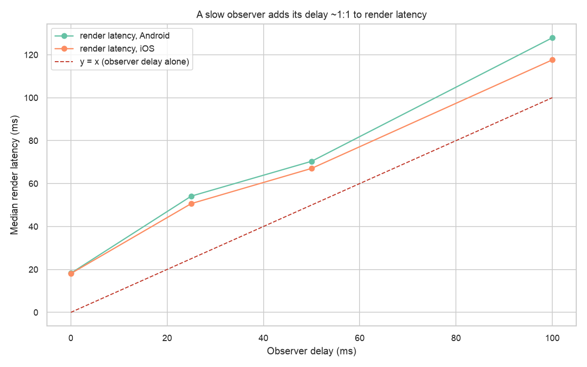
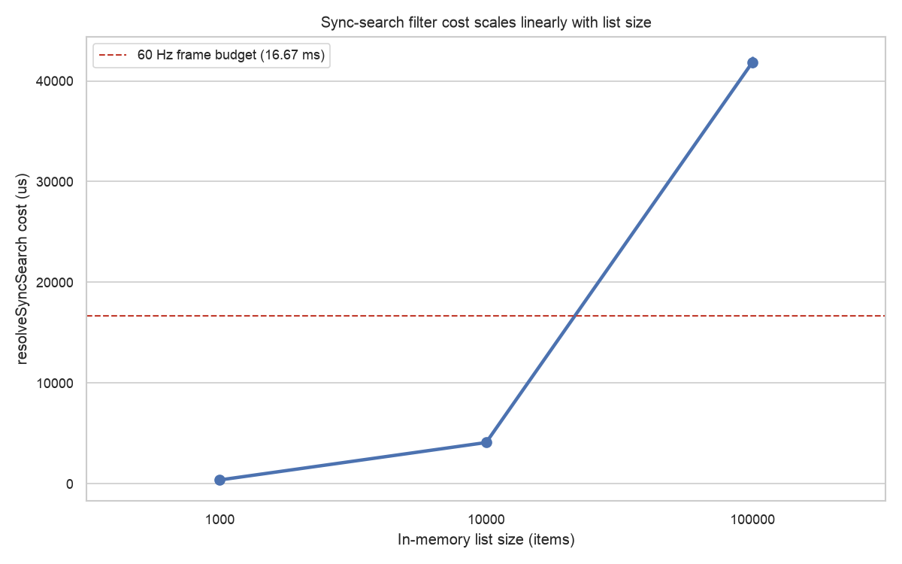
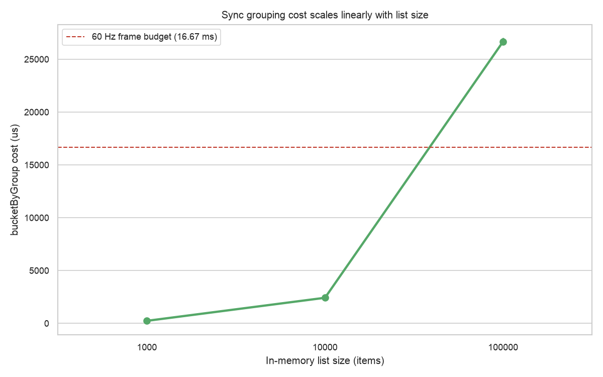
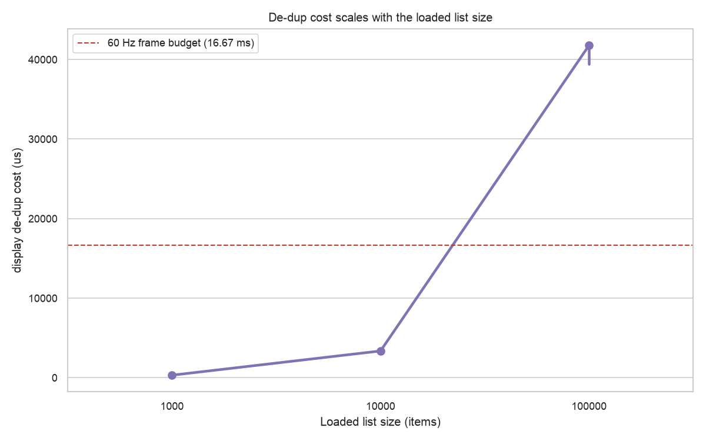
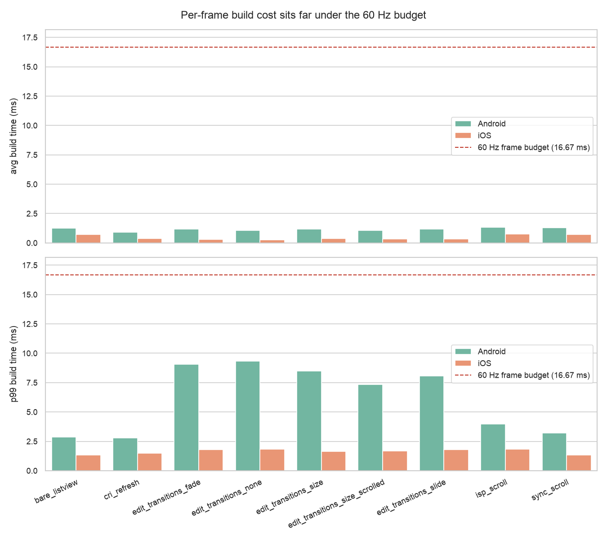
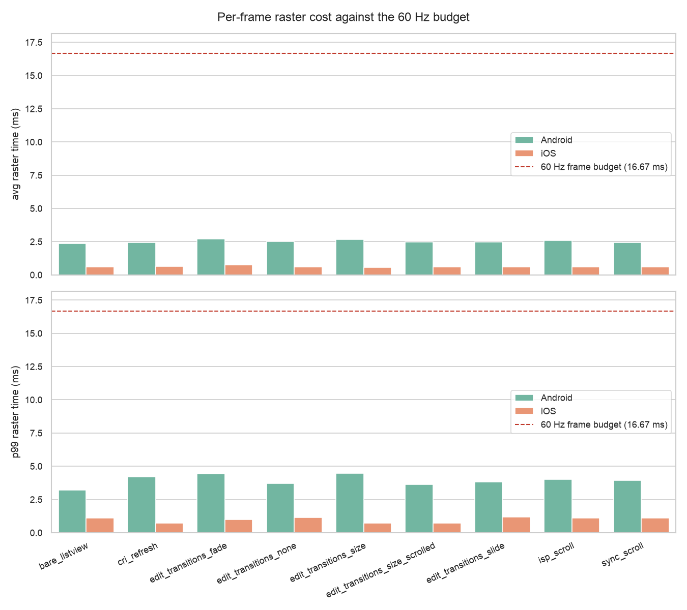

# Benchmark results

Captured **2026-11-05** against `2.0.1` at `9f468de, 0205ecc` on Dart SDK 3.13.7, UI scenarios on Android, iOS. N=10 iterations.

> Per-device measurements, reflecting each device's CPU, GPU, GC, OS scheduler and thermal state. Yours WILL differ, so capture your own baseline before measuring a delta.

## Observer on the critical path: a slow observer blocks rendering

The headline finding. list_smith invokes your observer *synchronously* on the page-load path, so a slow callback lands almost fully on the critical path. `slow_observer` blocks for a set delay on each callback and measures render latency across a sweep of delays: latency tracks the delay ~1:1 on top of a fixed baseline render, so a 50 ms observer pushes ~20 ms to ~70 ms on Android and ~17 ms to ~67 ms on iOS. Keep observer callbacks cheap and do heavy work elsewhere.

| Platform | Observer delay (ms) | Median render latency (ms) | Render minus observer (ms) | N |
|---|---:|---:|---:|---:|
| Android | 0 | 18.2 | 18.2 | 10 |
| Android | 25 | 54.1 | 29.1 | 10 |
| Android | 50 | 70.4 | 20.4 | 10 |
| Android | 100 | 127.9 | 27.9 | 10 |
| iOS | 0 | 18.1 | 18.1 | 10 |
| iOS | 25 | 50.7 | 25.7 | 10 |
| iOS | 50 | 67.1 | 17.1 | 10 |
| iOS | 100 | 117.6 | 17.6 | 10 |

## Sync-search filter cost vs list size

From the `sync_search_scaling` micro (AOT, `benchmark_harness`). `SyncListView` re-runs `resolveSyncSearch` synchronously on every committed query, so this is that cost as the in-memory list grows, under a naive case-insensitive `contains`. Where the median crosses the frame budget is the practical ceiling for that predicate.

| List size | N | Median (us) | IQR (us) | Median (ms) |
|---:|---:|---:|---:|---:|
| 1,000 | 10 | 379.64 | 8.42 | 0.38 |
| 10,000 | 10 | 4,022 | 167.93 | 4.02 |
| 100,000 | 10 | 41,793 | 900.06 | 41.79 |

## Sync grouping (bucketing) cost vs list size

From the `bucket_by_group_scaling` micro (AOT, `benchmark_harness`). Sync grouping reorders the filtered items into contiguous sections on every committed query, so this is that cost as the list grows, over fully interleaved input for worst-case reordering. It stacks on the search-filter cost above when a list does both.

| List size | N | Median (us) | IQR (us) | Median (ms) |
|---:|---:|---:|---:|---:|
| 1,000 | 10 | 232.95 | 2.63 | 0.23 |
| 10,000 | 10 | 2,407 | 43.88 | 2.41 |
| 100,000 | 10 | 26,489 | 605.96 | 26.49 |

## Overlap de-dup cost vs loaded list size

From the `dedup_scaling` micro (AOT, `benchmark_harness`). The async list de-dups overlapping pages by id as a computed view over the paging state, re-walking every loaded item on each change so the stored pages stay raw and the end policy can't read an all-duplicate page as the end. Measured at its worst case: no actual overlap, so nothing collapses and every item is retained. Off the scroll path, since it runs per page-load rather than per frame. Sub-millisecond for a few thousand loaded items and climbing from there, past the frame budget at tens of thousands in one live list.

| Loaded items | N | Median (us) | IQR (us) | Median (ms) |
|---:|---:|---:|---:|---:|
| 1,000 | 10 | 301.64 | 25.31 | 0.30 |
| 10,000 | 10 | 3,374 | 90.99 | 3.37 |
| 100,000 | 10 | 40,117 | 2,583 | 40.12 |

## Per-page bookkeeping

Confirms the bookkeeping costs ~nothing. `observer_dispatch` is one no-op observer callback, the null-check plus virtual call made on each page fetch. `wrapping_overhead` is the end-policy check before each page, rebuilding the page-item-counts as loaded pages grow. Any real fetch dwarfs both.

| Micro | Metric | Median (us) |
|---|---|---:|
| `observer_dispatch` | us / dispatch | 0.011 |
| `wrapping_overhead` (1 page) | us / key | 0.171 |
| `wrapping_overhead` (10 pages) | us / key | 0.169 |
| `wrapping_overhead` (100 pages) | us / key | 0.170 |

## UI scenarios: per-frame build cost

From the profile-mode `integration_test` scenarios, real frames on one device per platform. `avg`, `worst` and `p99 build` are the UI-thread build cost per frame, which is where list_smith's code runs, and `missed` counts frames over the 16.67ms budget. `isp_scroll` against `bare_listview` (same items and scroll, no list_smith) is the attribution: that small delta is what list_smith adds to a plain list. `sync_scroll` is the same scroll over a `ListSmith.sync` list with ids. `edit_transitions_none` makes the same edits as `_size`, `_fade` and `_slide` with no transition, so the gap is what animating them adds. `_size_scrolled` makes `_size`'s edits just above the screen, where the rows on it are held still.

| Scenario | Platform | Frames | Avg build (ms) | Worst build (ms) | p99 build (ms) | Missed |
|---|---|---:|---:|---:|---:|---:|
| `bare_listview` | Android | 610 | 1.23 | 5.14 | 2.88 | 0 |
| `bare_listview` | iOS | 610 | 0.71 | 1.47 | 1.35 | 0 |
| `cri_refresh` | Android | 849 | 0.89 | 6.73 | 2.79 | 0 |
| `cri_refresh` | iOS | 849 | 0.36 | 1.72 | 1.49 | 0 |
| `edit_transitions_fade` | Android | 500 | 1.17 | 9.52 | 9.05 | 0 |
| `edit_transitions_fade` | iOS | 500 | 0.30 | 1.97 | 1.78 | 0 |
| `edit_transitions_none` | Android | 500 | 1.06 | 11.90 | 9.32 | 0 |
| `edit_transitions_none` | iOS | 500 | 0.26 | 2.12 | 1.85 | 0 |
| `edit_transitions_size` | Android | 500 | 1.16 | 8.86 | 8.49 | 0 |
| `edit_transitions_size` | iOS | 500 | 0.39 | 1.75 | 1.64 | 0 |
| `edit_transitions_size_scrolled` | Android | 500 | 1.04 | 9.12 | 7.34 | 0 |
| `edit_transitions_size_scrolled` | iOS | 500 | 0.34 | 2.01 | 1.69 | 0 |
| `edit_transitions_slide` | Android | 500 | 1.19 | 9.83 | 8.07 | 0 |
| `edit_transitions_slide` | iOS | 500 | 0.33 | 1.92 | 1.81 | 0 |
| `isp_scroll` | Android | 609 | 1.32 | 6.61 | 3.99 | 0 |
| `isp_scroll` | iOS | 610 | 0.74 | 2.23 | 1.82 | 0 |
| `sync_scroll` | Android | 609 | 1.30 | 4.93 | 3.20 | 0 |
| `sync_scroll` | iOS | 610 | 0.72 | 2.39 | 1.35 | 0 |

## UI scenarios: per-frame raster cost

The same frames on the raster thread, which draws what the build produced. `missed` counts frames over the same budget. `worst` is usually the 1st captured frame, so it swings between runs.

| Scenario | Platform | Frames | Avg raster (ms) | Worst raster (ms) | p99 raster (ms) | Missed |
|---|---|---:|---:|---:|---:|---:|
| `bare_listview` | Android | 610 | 2.37 | 6.22 | 3.23 | 0 |
| `bare_listview` | iOS | 610 | 0.61 | 1.26 | 1.09 | 0 |
| `cri_refresh` | Android | 849 | 2.43 | 8.73 | 4.20 | 0 |
| `cri_refresh` | iOS | 849 | 0.63 | 56.52 | 0.72 | 1 |
| `edit_transitions_fade` | Android | 500 | 2.71 | 7.09 | 4.43 | 0 |
| `edit_transitions_fade` | iOS | 500 | 0.74 | 57.95 | 0.98 | 1 |
| `edit_transitions_none` | Android | 500 | 2.53 | 5.14 | 3.69 | 0 |
| `edit_transitions_none` | iOS | 500 | 0.59 | 1.53 | 1.13 | 0 |
| `edit_transitions_size` | Android | 500 | 2.67 | 6.30 | 4.47 | 0 |
| `edit_transitions_size` | iOS | 500 | 0.58 | 0.96 | 0.73 | 0 |
| `edit_transitions_size_scrolled` | Android | 500 | 2.48 | 6.77 | 3.62 | 0 |
| `edit_transitions_size_scrolled` | iOS | 500 | 0.59 | 1.01 | 0.73 | 0 |
| `edit_transitions_slide` | Android | 500 | 2.47 | 6.97 | 3.83 | 0 |
| `edit_transitions_slide` | iOS | 500 | 0.60 | 2.00 | 1.17 | 0 |
| `isp_scroll` | Android | 609 | 2.61 | 6.52 | 4.02 | 0 |
| `isp_scroll` | iOS | 610 | 0.61 | 1.25 | 1.12 | 0 |
| `sync_scroll` | Android | 609 | 2.45 | 5.76 | 3.95 | 0 |
| `sync_scroll` | iOS | 610 | 0.62 | 1.26 | 1.11 | 0 |

